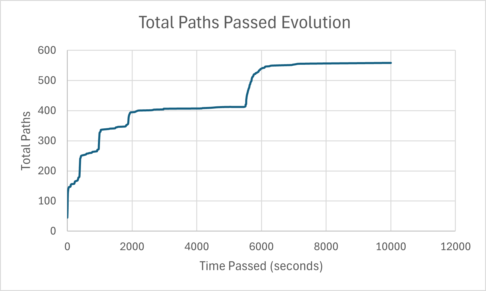
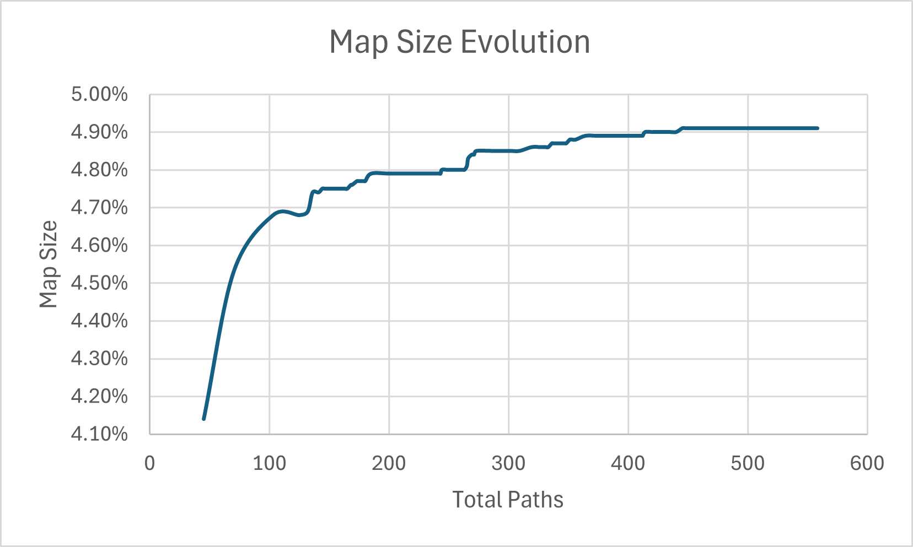

## Project 3A:

Project 3A is kind of straightforward: we just need to write tests to
cover as much code as possible. For the simplicity of the test running,
I used *bash* files in order to reduce number of accidental mistakes and
to reduce my time spent on rerunning the tests (further, all the code
calls were organized this way). Some tests were created by me by
analyzing what lines of code weren't covered yet, and therefore,
manually creating tests that Some tests take more than 1000 ms to run
(afl). Delete them would hit these lines of code. Other tests were
generated by *Gemini*, after full explanation of how tests suppose to be
written and what program does (these tests are usually the big ones). As
the result, over 90% code coverage was reached. 

## Project 3B:

### Error Fixes:

An error raised when trying to run `gcovr -s -e contrib -e intel -e mips
-e powerpc -r .` Fixed error with addition of
`--gcov-ignore-errors=source_not_found` flag (offered by the error text)

### Findings: 

Initially, I was trying to use pngs I manually find from the web. It
wasn't giving a spectacular result since code coverage was about 20%.
After, I started using github repositories with lot of pngs to choose
from (see sources for the repositories in the [Sources](#sources)
section). Then I created a specific folder that gets 50 random images
from **ALL** downloaded pngs into a specific folder, and only then runs
a coverage testing. This way I managed to reach 36.1% line coverage.

## Project 3C:

### Error Fixes:

via singing as a root `sudo su` and running `echo core
>/proc/sys/kernel/core_pattern` we are able to make afl run. 

50 testing pictures were taken from the same dataset that part 3B was
running. Some tests take more than 1000 ms to run (afl). I Deleted them.
Later, I deleted all the pngs that were bigger than 200px by 200px even
if they passed the time limit, since code was running way too slowly
(afl stuck on ~250 paths after several hours)

There were problems that appeared because I didn't manage to see
instructions clearly or because of minor mispellings (e.g. source path),
or because I ran the program Initially on WSL, and then transfered it on
the remote Google Cloud VM.

### Findings:

This project took most time to do. After several attempts, it took me
2.5 hours to run 558 paths.

There is an important difference between manual coverage and fuzz
coverage. In manual coverage, the test dataset is fixed (not changed)
and coverage program simply runs the program with the specified input,
checking what code lines and branches were reached.

In AFL, coverage testing software (AFL) checks what lines and code paths
have been executed, then changes the bytes of the input either by
slicing, bit flipping, and addition. If the changed input caused to find
new code paths (activate new code blocks), then it is saved and mutated
further. This allows to get the paths that were thought to be
unreachable by the developers and automate testing set development,
requiring less test data to be collected for similar result.
 

As we can see, total paths found increase step-wise, and it takes more
and more time for each new step to occur (see [figure 1](#figure-1)).
This is most likely explainable by the fact that AFL randomly finds a
new "kind" of png picture, that causes program to execute many new code
blocks. This png picture is then mutated so more and more paths are
being discovered for this "kind" of picture, until all the possible
paths are covered with this picture type.

<figure id="figure-1">
  
  <figcaption>Figure 1: Total paths found over time code ran.</figcaption>
</figure>

We can also look at map size vs total paths plot (see [figure
2](#figure-2)). Map size basically represents the number of branches
attended (since map basically stores what brancehs attended). Since
relationship is not linear and is getting "flatter and flatter" with
higher number of total paths, it is a sign that map is saturated and
colliding tuple (path) rate is too high. Therefore, bigger than 64kb SHM
region should be allocated.

<figure id="figure-2">
  
  <figcaption>Figure 2: Map size evolution over total paths found.</figcaption>
</figure>

## Sources:

- https://myslu.stlawu.edu/~kangstadt/teaching/spring26/340/p3.html -
Project instructions

- https://github.com/test-images/png/tree/main/202105 - png test images
from github

- http://www.schaik.com/pngsuite2011/pngsuite.html - png test images 

- https://github.com/yavuzceliker/sample-images - random images for
websites (usually they are big and have some "human" sense)

- https://github.com/lunapaint/pngsuite - another repository with lots
of random images, mostly random ""

- https://code.google.com/archive/p/imagetestsuite/source - special
image test suite for code coverage (provides 50% coverage libpng,
according to source)